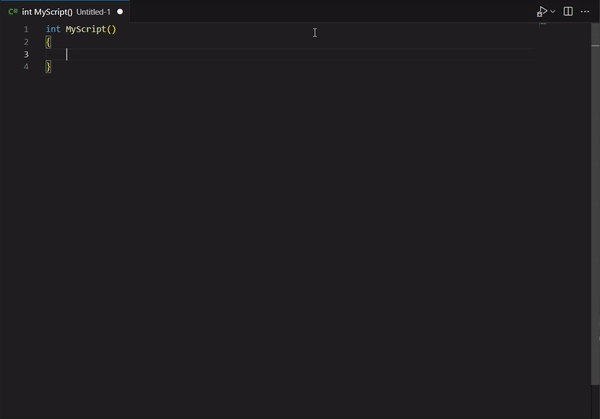

# prototyper

Compile and run whatever is in the currently selected editor!

[](src/images/conventional-example.gif)

Curently only C# is supported. JavaScript and other languages will be added in future releases, once they are supported by Headless.

- [Prototyper - GitHub](https://github.com/pwalkerdev/prototyper)
- [Headless - GitHub](https://github.com/pwalkerdev/Headless)

## Features

Build & run your script seamlessly from within VSCode - no project, scaffolding or setup required.

For .NET, run command: `Prototyper: Evaluate C# Script`. The code in the currently opened editor will then be compiled and evaluated. The output will be shown in the terminal.
**NOTE:** Currently .NET code can only contain a single main method which will be the assumed entry point, although local/nested methods are supported. The method can be implemented conventionally or with expression body (lambda) syntax. For example:

```csharp
// expression body
() => 5 + 10
```

```csharp
// conventional
int MyScript()
{
    "Hello World!".Dump(); // LinqPad inspired extension method .Dump() can be invoked to get output from a unit of work
    return 5 + 10;
}
```

## Requirements

- [.NET SDK](https://dotnet.microsoft.com/en-us/download/dotnet) Used to compile C# scripts. Must be .NET or .NET core - .NET framework is currently unsupported.
- [Headless](https://github.com/pwalkerdev/Headless) Is a framework for interpreting and executing code. Headless is bundled with the prototyper VSCode extension by default, and the source code is required when running the extension locally. When cloning this repository, make sure to fetch all sub-modules and you will be able to find it in `./modules/Headless`

## Extension Settings

Currently there are no settings, configuration options will be added in soon.

## Known Issues

- If you call `sendText()` on a VSCode terminal immediately after creating it, it may not 'receive' the text which can cause problems, given how headless is desingned. This is to say, that you need to wait until the new terminal is 'ready' to receive input. I could not find a reliable method of verifying that the terminal instance is initialised, not for lack of trying. So, currently the code just delays the execution of headless for a short period of time. If anyone knows a better way to do this please let me know!

## Packaging

If you want to build the extension VSIX locally and install it into VSCode, you will need to package it using the `vsce` tool. First install it via npm with: `npm install -g @vscode/vsce`. Then you can build and pack the VSIX file using: `vsce pack --out ./release/prototyper.x.x.x.vsix --yarn --pre-release`. Once done, you can install the extension into VSCode by opening up the extensions tab, clicking the context menu button, and selecting the option to install VSIX.

Also note that the `dist` folder must contain a subfolder called `bin` which houses the Headless compiled assemblies. At this point in time, building the submodule and copying it to this folder must be done manually before running the `vsce pack` command.

To compile the Headless submodule, you will need to run: `dotnet publish -f net8.0 -c Release` from the `./modules/Headless/Headless.` folder.

## Release Notes

### 0.0.5

Functionally same as version 0.0.4 but resolving an issue with the marketplace release

### 0.0.4

- Update Headless back-end to latest version [more info](https://github.com/pwalkerdev/Headless/pull/4)
- Implement new command providing support for debugging C# scripts
- Evaluate/debug commands now only appear in command palette when the target language matches the what is selected in the active editor
- Various performance and quality of life improvements

### 0.0.3

- Update Headless back-end to latest version [more info](https://github.com/pwalkerdev/Headless/pull/2)
- Add new VSCode command to evaluate JavaScript
- Add new "auto" command which will evaluate based on the editor's currently selected language

### 0.0.2

No functional changes, just small modifications to the readme.

### 0.0.1

Initial release of prototyper! This project is in it's infancy and very much still a work in progress. The current release contains little more than the bare minimum. Only C# is supported and scripts cannot be run concurently. Scripts must be written in a specific way (see notes above) to be interpreted correctly by headless.  
All of this will be improved upon in future iterations.

## License

This project is licensed under the GNU GPLv3 License - see the LICENSE.md file for details

---
  
<p align="center">
  Written by Paul Walker - github.com/pwalkerdev
</p>
